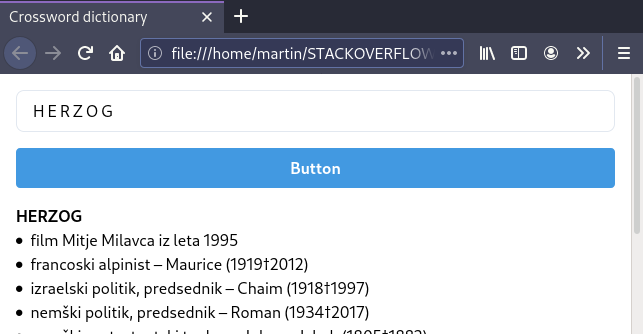
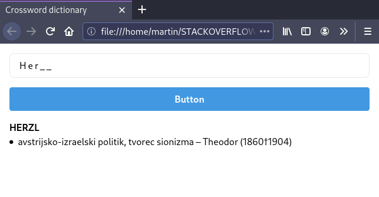
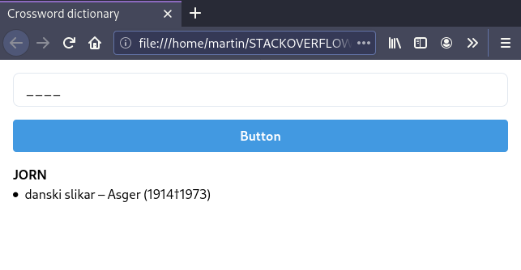
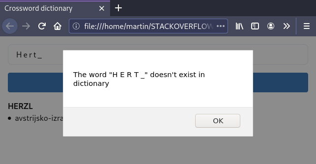

# Crossword dictionary on a flask service

## Requirements

The app uses flask as a webserver:
`pip install flask`

For RESTful API this flask extension is used
`pip install flask-restful`

## How to run the program

1. execute the app.py in the backend directory
2. open a browser 
3. open the index.html in the frontend directory
4. search a word

**Examples of searching**

To search a specific word:

To search a partial word:

To search any word with a specific lentgh

If the word exist in the database then you will get a HTTP resposte containing a JSON object

If the word does not exist in the database you will get an error:

## The API

**Examples of the API**

To search a specific word:

http://127.0.0.1:5000/herzog

If the word exist in the database then you will get a HTTP resposte containing a JSON object

To search a partial word:

http://127.0.0.1:5000/h__z__

If one or more words in the database matches the pattern of the partial word then you will get a HTTP resposte containing a list of one or more JSON objects
